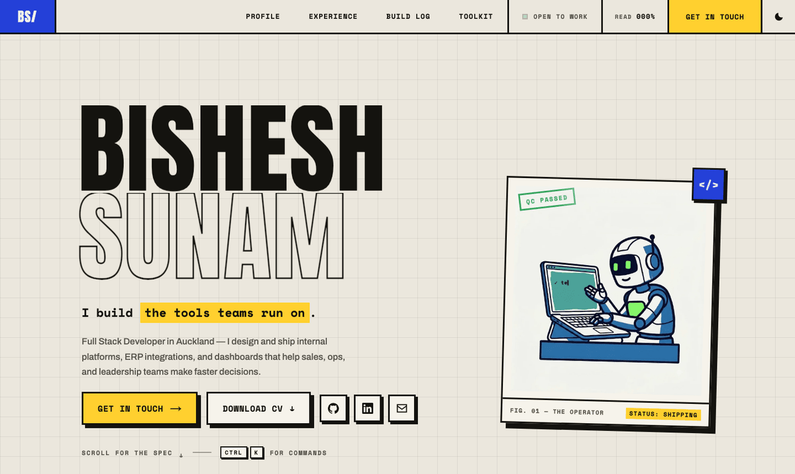
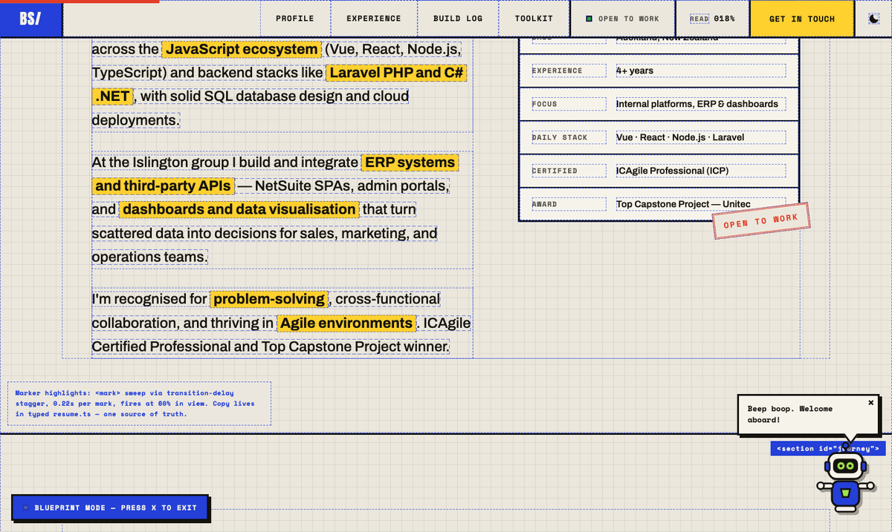
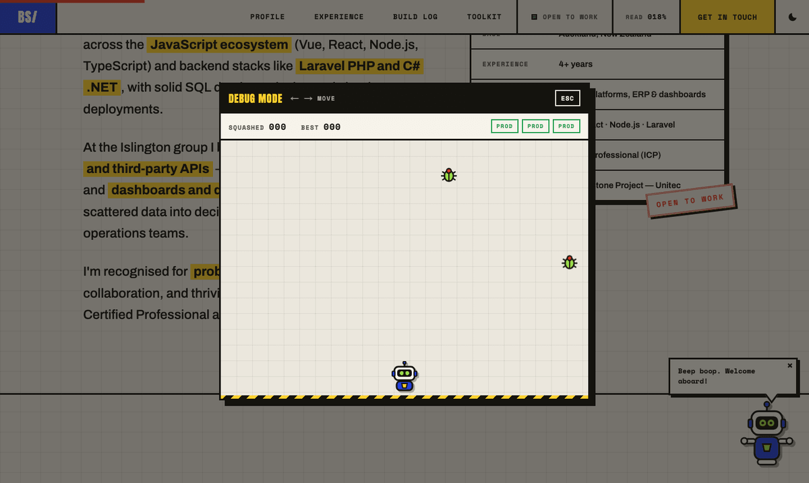

# bishesh58.com

Neo-brutalist portfolio, built as a **build sheet**: bone paper, working blue, highlighter yellow, hard shadows, rubber stamps, and a robot who takes his job seriously.

**Live: [www.bishesh58.com](https://www.bishesh58.com)**



## Stack

Next.js 15 (App Router, static prerender) · React 19 · TypeScript · [motion](https://motion.dev) · CSS Modules + design tokens · Upstash Redis (REST) · Vercel

No UI library, no Tailwind, no CMS. One typed data file ([`src/data/resume.ts`](src/data/resume.ts)) drives every section, so the site and the facts can't drift apart.

## Features

### The visible ones

- **Build Log dossiers** — every project row opens into a work order (Problem / Build / Outcome) with a red `NO PUBLIC DEMO` stamp, because internal tools don't get public demos.
- **Assembly-line intro** — on your first visit the hero robot is *manufactured*: frame craned in, illustration plotted top-to-bottom behind a print head, spec plate fitted, `QC PASSED` stamp slammed. Replay with [`?assemble=1`](https://www.bishesh58.com/?assemble=1).
- **Night shift** — between 11pm and 6am Auckland time the mascot sleeps in a nightcap and the nav reads "Back at sunrise NZT". Preview with [`?night=1`](https://www.bishesh58.com/?night=1).
- **Multiplayer presence** — other live visitors appear as tiny robot markers on the reading-progress rail, at their actual scroll positions. Anonymous by construction: a random per-tab id and a percentage, nothing else.
- **Visitor counter** — old-school `VISITOR № 004231` chip in the footer, counted once per browser.
- **Theme** — light/dark with a stepped-wipe View Transition; system-aware with a pre-hydration inline script (no flash).

### The hidden ones

| Trigger | What happens |
|---|---|
| `Ctrl`+`K` | Command palette |
| `X` | Blueprint x-ray — dashed construction lines **plus real engineering margin notes** on every section |
| Click the mascot 🤖 | **DEBUG MODE** — an arcade mini-game: squash falling bugs before they reach the production line. Global top-10 leaderboard, three-letter arcade sign-in |
| `G` then `T` | Guided tour — the robot walks you through every section, narrating |
| type `hire` | A stamp of approval |
| `↑↑↓↓←→←→BA` | You know what this does |
| `?` | The full cheat sheet |





## Engineering notes

A few decisions that aren't obvious from the outside:

- **Icons are vendored, not CDN'd.** `cdn.simpleicons.org` deleted four brand marks mid-2026 and quietly broke the Toolkit section. All 32 SVGs now live in [`public/icons`](public/icons), recovered where necessary from older package releases. Zero third-party requests.
- **Redis features degrade to invisible.** The visitor counter, leaderboard, and presence all share one helper ([`src/lib/redis.ts`](src/lib/redis.ts)); if the store is unconfigured or down, the API reports `null` and the UI simply doesn't render. No error states, no skeletons.
- **The arcade never re-renders during gameplay.** The simulation is a single `requestAnimationFrame` loop mutating DOM transforms inside a ref; React state only changes on catches and misses. Gameplay keys are intercepted in the capture phase so the site's other single-key shortcuts can't misfire mid-game.
- **Blueprint annotations cost zero JavaScript.** Each section carries a `data-note` attribute rendered via CSS `attr()` — only visible in x-ray mode.
- **Presence needs no websockets.** Tabs heartbeat scroll positions into a Redis hash every 10s and read everyone else's back. Entries expire in 30s; the hash self-destructs after 2 minutes of quiet.
- **The hero image went from 1.3 MB PNG to 45 KB WebP** ([`scripts/generate-assets.mjs`](scripts/generate-assets.mjs)), and the OG card is a purpose-built 1200×630 at 58 KB.
- **Reduced motion is a first-class path** — every animation (including the assembly line and the tour's smooth scrolling) checks `prefers-reduced-motion`.

## Running locally

```bash
npm install
npm run dev        # http://localhost:3000
```

```bash
npm run lint       # ESLint (next/core-web-vitals + typescript)
npm run typecheck  # tsc --noEmit
npm run build      # production build
```

The Redis-backed features (counter, leaderboard, presence) need two env vars, otherwise they silently sit out:

```bash
UPSTASH_REDIS_REST_URL=...
UPSTASH_REDIS_REST_TOKEN=...
```

## Structure

```
src/
  data/            resume.ts (single source of truth), tour script, quips
  app/             layout (fonts, metadata, JSON-LD), robots, sitemap, api/
  components/
    sections/      Hero, About, Journey, Projects (dossiers), Skills, Contact, Footer
    RobotMascot/   the mascot: poses, quips, guided tour, night shift
    wow/           command palette, blueprint mode, arcade, presence, easter eggs
  hooks/           useTheme, useSectionSpy, useNZNight, usePrefersReducedMotion
  lib/             redis helper, section store
```

---

Built by [Bishesh Sunam](https://www.linkedin.com/in/bishesh-sunam-89a807115) in Auckland, New Zealand — with Next.js and too much coffee.
